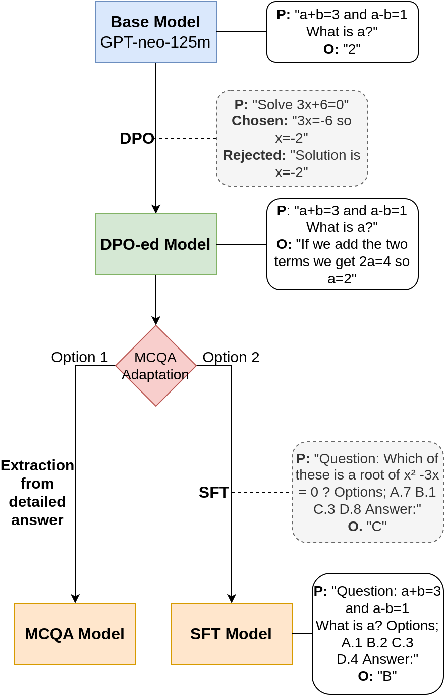

# STEM-GPT: Your Future AI Teaching Assistant?

**Author**: Agatha Duzan

---

## Overview

STEM-GPT is an AI assistant designed to answer multiple-choice questions (MCQ) in STEM subjects. This project aims to enhance the learning experience for EPFL students by providing accurate answers and detailed explanations.

**Key Highlights:**
- **Base Model**: Built upon GPT-Neo 125M, a lightweight yet powerful language model.
- **Techniques Used**:
  - Direct Preference Optimization (DPO) for aligning the model with human preferences.
  - Supervised Fine-Tuning (SFT) for improving multiple-choice question answering.
- **Final Model**: Open-source and optimized for running on personal devices, ensuring accessibility and privacy.

---

## Pipeline

The pipeline from base to final models is summarized in the image below:

---

## Learn More

For additional information on methodology, datasets, evaluation, and results, refer to the [project report](report.pdf).